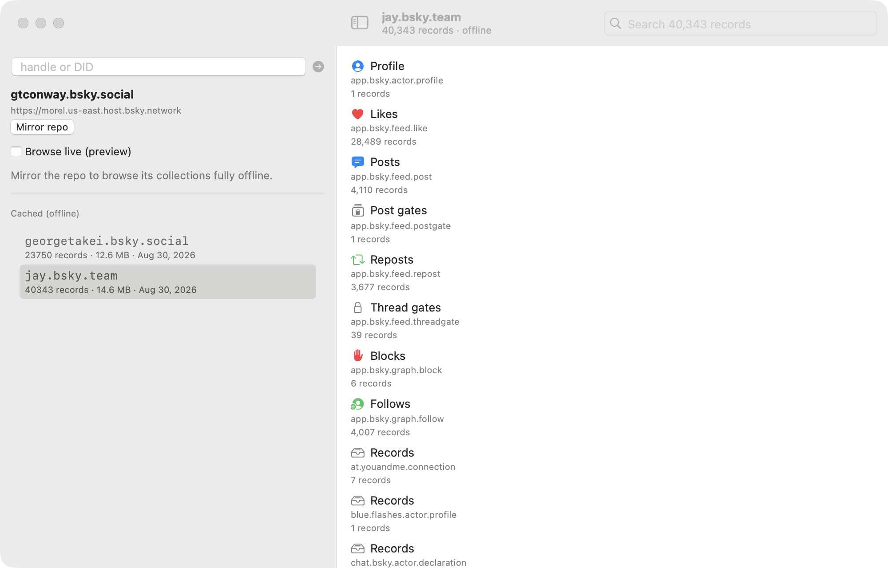

# Atmosplorer

A native macOS desktop client for browsing [AT Protocol](https://atproto.com)
repos. Its differentiator is **offline-first**: pull a repo's CAR archive once,
then browse every post, like, follow, and starter pack with zero network.

Built on a small Zig core written for this project, wrapped in Swift. No third-party
Swift ATProto SDK — the only non-Swift dependency is the protocol engine itself,
which we picked (and wrote the reader-facing pieces for) rather than reimplementing
AT Protocol from scratch in Swift.




*The mirrored repo browser, fully offline — collections on the left, search across every record, detail views on the right.*

## Why

Every web client has to hit a server. A repo's CAR — the atproto content
addressed archive — is *self-contained*: one commit block, every MST node, and
every record block. Download it once, and you own a permanent, offline,
browseable copy of someone's entire repo. Web clients can't do that; a native
client can. That's the whole reason this app exists.

Status: the first four roadmap milestones are landed (SwiftUI shell, offline
cache, browseable content, local search). For maintainers: how to version and
ship a new tag is in `RELEASING.md`.

## Architecture

Three layers, one exit point:

```
zat-overlay + upstream zat   — Zig AT Protocol kit (vendored by sync-zat.sh:
        │                       upstream + our Explorer/C-ABI additions)
        │  compiles to libzat_c.a + zat.h (the C ABI / Swift boundary)
        ▼
zat-swift            — our typed Swift wrapper: ZatExplorer, ZatError, models,
        │              ZatFakeTransport (deterministic offline tests)
        ▼
app                  — the SwiftUI desktop client (SPM executable), depends
                       only on ../zat-swift, never touches the C ABI directly
```

- **`zat-swift/Vendor/zat-overlay`** — our additions on top of the **zat** kit
  (`v0.4.5`, MIT): the reader-facing Explorer facade, the CAR record iterator,
  and the C ABI, plus the build wiring. Upstream zat (AT Protocol primitives
  for Zig: syntax + identity resolution, XRPC, CBOR/CAR/MST, firehose +
  jetstream, OAuth, crypto) is hosted on [Tangled](https://tangled.org), an
  AT Protocol–native code forge, at `tangled.org/zat.dev/zat`, and is fetched
  hash-pinned to `0.4.5` by `Scripts/sync-zat.sh` (see `THIRD-PARTY.md` for
  the full attribution story).
- **`zat-swift`** — the Swift package that links the prebuilt static library
  and exposes a typed, Swift-idiomatic API. After *any* change to the Zig core,
  rerun `Scripts/sync-zat.sh` to rebuild and re-vendor the binary products.
- **`app`** — the SwiftUI client. Two targets: `ZatAppCore` (SwiftUI-free,
  testable: the async session bridge, error mapping, offline repo cache,
  content extraction) and `Atmosplorer` (the window).

## Prerequisites

- **Zig 0.16+** (the kit's `build.zig.zon` pins `0.16.0-dev` minimum)
- **Swift 6** toolchain (Xcode / CLT), macOS 13+

## Build & test

From the workspace root:

```sh
# 1. Vendor the Zig core and refresh the Swift wrapper's binary products
#    (always needed once per fresh clone — the packaged xcframework is a build
#    artifact and is gitignored rather than committed). sync-zat.sh fetches
#    the pinned upstream zat package via zig fetch + layers our overlay;
#    see zat-swift/Vendor/zat-overlay.
cd zat-swift
Scripts/sync-zat.sh           # regens Vendor/ZatC.xcframework + copied zat.h
swift build
swift test                    # offline; live tests gated behind ZAT_INTEGRATION=1

# 2. The app
cd ../app
swift build
swift test                    # fully offline (ZatFakeTransport + embedded CAR fixture;
                              # live traversal tests skip unless ZAT_INTEGRATION=1)
swift run Atmosplorer         # the window: type a handle/DID, e.g. atproto.com
```

Live integration tests (hit real infrastructure) are opt-in:

```sh
# wrapper's live suite
ZAT_INTEGRATION=1 swift test --filter ZatExplorerIntegrationTests
# the app's live traversal (resolve → describeRepo → listRecords, via AppSession)
ZAT_INTEGRATION=1 swift test --filter AppLiveTraversalIntegrationTests
# Zig core's live smoke (resolve → describeRepo → listRecords → decode repo CAR)
# cd zat-swift/.vendor/zat-src && zig build zat-c-smoke
```

## Try it

```sh
cd app && swift run Atmosplorer
```

Resolve a handle (say `atproto.com`) and hit **Mirror repo** on the resolved
identity to download its full CAR once. Disconnect the network — everything
still browses, because the client now owns the whole repo.

## Credits & licensing

- **Our code** (`app/`, `zat-swift/`): MIT — see `LICENSE`.
- **zat** (the Zig core): MIT, © 2025 nate nowack / zzstoatzz.io — hosted
  on Tangled (an AT Protocol–native code forge) at `tangled.org/zat.dev/zat`,
  pinned to `0.4.5` by hash in `sync-zat.sh`, vendored into
  `zat-swift/Vendor/ZatC.xcframework`; its license is retained.
- Deterministic test fixtures from `bluesky-social/atproto-interop-tests`.

See `THIRD-PARTY.md` for the full attribution and vendoring story.